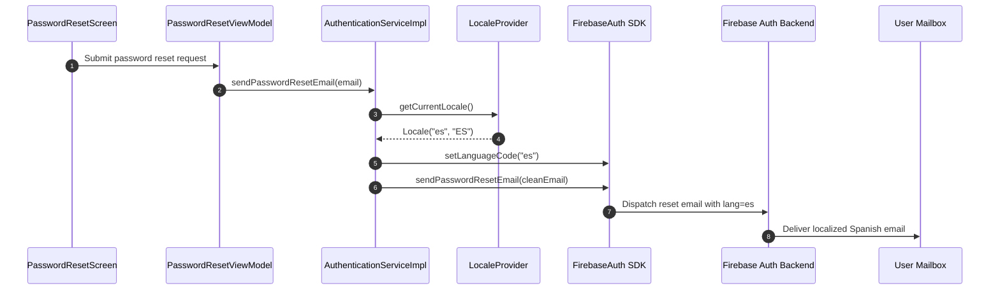

# Firebase Authentication Email Localization & Sender Deliverability

> [!IMPORTANT]
> **Production Domain Alignment:** This guide aligns with the official production domain `splittrip.eu` established in [#1657](https://github.com/pedrazamiguez/split-trip/issues/1657). It strictly avoids hardcoded secrets, private tokens, or private credentials. All values use public addresses or generic placeholders.

---

## Overview

SplitTrip relies on Firebase Authentication for user identity management, including transactional emails for password resets, email verification, and email change notices.

This document describes:
1. **Client-Side Localization:** How the app communicates the user's active locale to Firebase Authentication before dispatching transactional emails.
2. **Firebase Console Template Configuration:** The distinction between Firebase's built-in multilingual templates and custom templates, explaining why standard templates must be preserved.
3. **Custom Sender Domain & Deliverability:** The DNS records (SPF, DKIM, DMARC) and Firebase Console setup required to send emails from `noreply@splittrip.eu` with reply-to `support@splittrip.eu` instead of the default unverified `noreply@<project>.firebaseapp.com` subdomain, preventing emails from landing in spam.

---

## 1. Client-Side Localization Mechanism

### 1.1 Architecture & Flow

When a user requests a password reset or receives an auth-related email, Firebase's email delivery infrastructure selects the email language based on the client's configured language code.



### 1.2 Implementation in `:data:firebase`

In `AuthenticationServiceImpl.kt` (`:data:firebase`), `LocaleProvider` from `:core:common` is injected:

```kotlin
class AuthenticationServiceImpl(
    private val firebaseAuth: FirebaseAuth,
    private val cloudUserDataSource: CloudUserDataSource,
    private val performanceMonitor: PerformanceMonitor,
    private val localeProvider: LocaleProvider
) : AuthenticationService {

    override suspend fun sendPasswordResetEmail(email: String): Result<Unit> = runCatching {
        firebaseAuth.setLanguageCode(localeProvider.getCurrentLocale().language)
        val cleanEmail = email.trim().lowercase()
        try {
            firebaseAuth.sendPasswordResetEmail(cleanEmail).await()
        } catch (e: Exception) {
            val canonicalEmail = User.canonicalizeEmail(cleanEmail)
            if (cleanEmail != canonicalEmail) {
                firebaseAuth.sendPasswordResetEmail(canonicalEmail).await()
            } else {
                throw e
            }
        }
    }
}
```

### 1.3 Locale Handling & Fallback

- `localeProvider.getCurrentLocale().language` extracts the 2-letter ISO 639-1 language code (e.g. `"es"` for Spanish, `"en"` for English).
- In `LocaleProviderImpl` (`:core:common`), regional language variants (such as Andalûh `es-ES`) map to the base Spanish locale code `"es"`.
- When `firebaseAuth.setLanguageCode("es")` is called, Firebase Auth serves the localized Spanish email template and appends `&lang=es` to the action URL in the email.
- When `firebaseAuth.setLanguageCode("en")` is called, Firebase Auth serves the standard English template and appends `&lang=en`.

---

## 2. Firebase Console Email Templates Behavior

> [!CAUTION]
> **Do NOT create customized template text in Firebase Console if you want multi-language emails.**

### 2.1 Built-in Multilingual Templates vs. Custom Templates

- **Built-in Standard Templates:** Firebase Authentication provides officially translated standard email templates for dozens of languages, including Spanish (`es`) and English (`en`). These templates automatically match the `languageCode` set by the client SDK.
- **Custom Templates Limitation:** Firebase Console does **not** support creating multiple localized versions of custom email templates. It only supports a single template per action.
- **Override Behavior:** If you edit or customize the email body or subject in **Authentication → Templates → Password reset**, Firebase will treat this as a single global override. It will send that exact custom text to **all** users, completely disabling Google's automatic multi-language translations.

### 2.2 Recommended Template Settings

In **Firebase Console → Authentication → Templates**:

1. **Password reset:**
   - **Sender name:** `SplitTrip`
   - **Reply-to:** `support@splittrip.eu`
   - **Message / Body:** Leave as the **default standard template** (or click **Reset to default** if previously modified).
2. **Email address verification:**
   - **Sender name:** `SplitTrip`
   - **Reply-to:** `support@splittrip.eu`
   - **Message / Body:** Leave as the **default standard template**.
3. **Email change notice:**
   - **Sender name:** `SplitTrip`
   - **Reply-to:** `support@splittrip.eu`
   - **Message / Body:** Leave as the **default standard template**.

---

## 3. Custom Sender Domain & Deliverability (`splittrip.eu`)

### 3.1 The Spam Problem

By default, Firebase dispatches emails from `noreply@<project-id>.firebaseapp.com`. Because this domain is shared across thousands of Firebase projects and lacks a verified organization identity, major email providers (Gmail, Microsoft Outlook / Hotmail, Yahoo) frequently flag messages as spam or junk.

To achieve reliable deliverability, emails must be dispatched from our authenticated custom domain `splittrip.eu`.

### 3.2 Firebase Console Custom Domain Setup

1. Open the [Firebase Console](https://console.firebase.google.com/) and navigate to **Authentication → Templates**.
2. Click the edit (pencil) icon on any email template (e.g., **Password reset**).
3. Click **Customize domain** (or **Sender email**).
4. Enter `splittrip.eu`.
5. Firebase generates DNS records for:
   - **Domain Ownership Verification:** A `TXT` record.
   - **DKIM (DomainKeys Identified Mail):** 2 `CNAME` records for cryptographic email signing.
   - **SPF (Sender Policy Framework):** A `TXT` record authorizing Firebase mail servers.
6. Once records are added to DNS and verified, click **Apply Custom Domain**.

### 3.3 DNS Records Specification

Configure the following records in the DNS provider for `splittrip.eu` (e.g. IONOS, Cloudflare, Route 53):

| Host / Name | Record Type | Value / Destination | Purpose |
|---|---|---|---|
| `splittrip.eu` | `TXT` | `firebase=split-trip-xxxxxx` *(from Firebase Console)* | Domain ownership verification |
| `<selector1>._domainkey.splittrip.eu` | `CNAME` | `<selector1>.dkim.firebasemail.com` *(from Firebase Console)* | DKIM signing key 1 |
| `<selector2>._domainkey.splittrip.eu` | `CNAME` | `<selector2>.dkim.firebasemail.com` *(from Firebase Console)* | DKIM signing key 2 |
| `splittrip.eu` | `TXT` | `v=spf1 include:_spf.firebasemail.com ~all` | SPF: Authorizes Firebase mail servers |
| `_dmarc.splittrip.eu` | `TXT` | `v=DMARC1; p=none; rua=mailto:support@splittrip.eu` | DMARC policy & aggregate reporting |

> [!NOTE]
> **Merging SPF Records:**
> A domain must only have **one** SPF `TXT` record. If an SPF record already exists (e.g. for inbound email routing or an email forwarder), merge the Firebase include mechanism:
> ```text
> v=spf1 include:_spf.firebasemail.com <other-includes> ~all
> ```

### 3.4 Authorized Domains

In **Firebase Console → Authentication → Settings → Authorized domains**, ensure the following domains are registered:
- `splittrip.eu`
- `www.splittrip.eu`
- `localhost` *(for development/testing)*

This ensures that email action links (such as password reset and email verification handlers) are permitted to redirect through the custom domain.

---

## 4. Deliverability Troubleshooting & Verification

### 4.1 Verification Checklist

- [ ] **DNS SPF Check:**
  ```bash
  dig splittrip.eu TXT +short | grep "include:_spf.firebasemail.com"
  ```
- [ ] **DNS DKIM Check:**
  ```bash
  dig <selector1>._domainkey.splittrip.eu CNAME +short
  ```
- [ ] **DNS DMARC Check:**
  ```bash
  dig _dmarc.splittrip.eu TXT +short
  ```
- [ ] **Email Receipt & Header Inspection:**
  1. Trigger a password reset from the app while set to Spanish.
  2. Confirm the subject line and email body are in Spanish.
  3. Inspect email headers in Gmail/client ("Show original"):
     - `SPF: PASS` with domain `splittrip.eu`
     - `DKIM: PASS` with domain `splittrip.eu`
     - `DMARC: PASS`
  4. Trigger a password reset while set to English.
  5. Confirm the subject line and email body are in English.

### 4.2 Deliverability Best Practices

1. **DMARC Policy Progression:**
   - Start with `p=none` (monitoring only) to collect aggregate reports at `support@splittrip.eu`.
   - After confirming that legitimate traffic passes SPF and DKIM without alignment failures, advance to `p=quarantine` and eventually `p=reject`.
2. **Domain Reputation & Warm-Up:**
   - Transactional volumes for password resets are naturally low and organic, requiring no artificial warm-up.
   - Avoid sending bulk marketing emails through Firebase Authentication.
