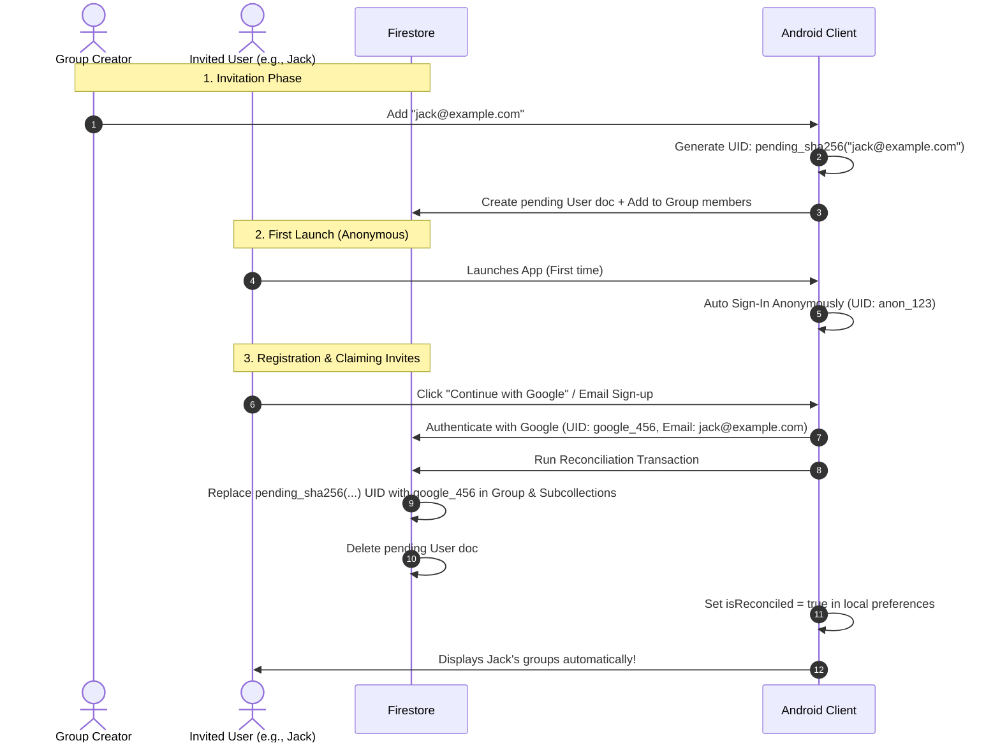

# User Reconciliation & Firebase Anonymous Auth

In SplitTrip, we support an onboarding flow where group creators can invite members by email before those members have registered an account. 

To bridge the gap between unregistered invitees and permanent user profiles, SplitTrip implements a **User Reconciliation** mechanism integrated with Firebase Anonymous Authentication.

---

## 1. Conceptual Design

### The Lifecycle of a Member's Identity



1. **Deterministic Placeholder UIDs:**
   If we assign random temporary IDs to unregistered invitees, a person added to multiple groups by different creators would have distinct, unlinked IDs. To avoid this, we generate a deterministic UID derived from their email address:
   `userId = "pending_" + sha256(email.trim().lowercase())`
   This guarantees that if multiple group creators add the same email address, they will all reference the exact same pending user UID.
2. **Anonymous Auth at Startup:**
   On fresh app start, the app automatically signs in the user using Firebase Anonymous Authentication (`signInAnonymously()`). This allows immediate, offline-first interactions without requiring credentials.
3. **Upgrading / Registering:**
   When the user logs in via Google or signs up with Email/Password, their credentials overwrite or upgrade their session. Once authenticated with a verified email (e.g., `jack@example.com`), the app identifies that they have pending invites associated with `pending_sha256("jack@example.com")` and triggers the **Reconciliation Flow**.

---

## 2. Architecture & Implementation

The reconciliation flow spans the entire multi-module architecture:

```
:app                    → Wires DI, hosts AppNavHost (triggers self-healing check)
:domain                 → Business logic: ReconcileUnregisteredUserUseCase
:data                   → Repository orchestrator (delegates to local and cloud)
:data:local             → Room database: local updates and UserPreferences
:data:firebase          → Firestore: multi-document transactional migrations
```

### A. The Domain Layer

* **[User](../domain/src/main/kotlin/es/pedrazamiguez/splittrip/domain/model/User.kt):** Represents the user model. Features `isPending: Boolean` to differentiate unregistered placeholder profiles.
* **[ReconcileUnregisteredUserUseCase](../domain/src/main/kotlin/es/pedrazamiguez/splittrip/domain/usecase/user/impl/ReconcileUnregisteredUserUseCaseImpl.kt):**
  1. Checks if `isReconciled` is already `true` for the active user (early exit).
  2. Generates the deterministic `pendingUserId` from the email.
  3. Invokes the `groupRepository.reconcileUnregisteredUser(pendingUserId, activeUserId)` to migrate groups and financial data.
  4. Deletes the pending user profile from the database.
  5. Marks `isReconciled = true` in local user-scoped preferences.

### B. The Cloud / Remote Layer (Firestore)

Because many documents reference member UIDs, the cloud migration must be atomic. It is implemented in **[FirestoreGroupDataSourceImpl](../data/firebase/src/main/kotlin/es/pedrazamiguez/splittrip/data/firebase/firestore/datasource/impl/FirestoreGroupDataSourceImpl.kt)**:

1. **Find Matching Groups:** Queries the `/groups` collection where `memberIds` array contains `pendingUserId`.
2. **Execute Transaction:** For each matching group, a Firestore Transaction executes to ensure atomicity. Due to Firestore transaction constraints, **all read operations are executed before any write/update operations**:
   * **Reads:** Fetch the `Group` document, `GroupMember` subcollection document, and all associated nested `expenses`, `contributions`, and `cash_withdrawals`.
   * **Writes:**
     * Replace `pendingUserId` with `activeUserId` in the group's `memberIds` array.
     * Write a new `GroupMember` document under `/groups/{groupId}/members/{activeUserId}` containing the user reference to the new profile, and delete `/groups/{groupId}/members/{pendingUserId}`.
     * Re-key all expense splits, payers, contributions, and cash withdrawals from `pendingUserId` to `activeUserId`.
3. **Delete Pending User Profile:** Deletes `/users/{pendingUserId}`.

> [!TIP]
> **Token Propagation & Retry Logic:**
> When logging in via Google, there may be a slight delay (race condition) before the Firestore client SDK receives the updated auth token. To prevent transient `PERMISSION_DENIED` errors, Firestore database transactions in `FirestoreGroupDataSourceImpl` and `FirestoreUserDataSourceImpl` are wrapped in a `retryOnPermissionDenied` helper that automatically retries the operation up to 3 times with a 500ms delay.

---

## 3. Firestore Security Rules

To allow secure, decentralized reconciliation, `firestore.rules` enforces strict conditions:

1. **Pending User Profile Access:**
   Any authenticated user is permitted to create a pending profile (when adding an unregistered member by email), but only the authenticated owner matching that email's hash can delete or update it.
   ```javascript
   function isPendingUserOfCurrentAuth(pendingUserId) {
     return isAuthenticated()
       && request.auth.token.email != null
       && pendingUserId == "pending_" + hashing.sha256(request.auth.token.email.lower()).toHexString().lower();
   }
   ```
2. **Group Modification Access:**
   A user can modify a group document (specifically, the reconciliation update to `memberIds`) if they are already in the `memberIds` array, OR if they are the pending owner whose email hash matches one of the group's `memberIds`:
   ```javascript
   function isMemberOrPending(memberIds) {
     return isAuthenticated() && (
       request.auth.uid in memberIds ||
       (
         request.auth.token.email != null &&
         ("pending_" + hashing.sha256(request.auth.token.email.lower()).toHexString().lower() in memberIds)
       )
     );
   }
   ```

---

## 4. Self-Healing Mechanism

If a user signs in but the app crashes, loses network, or encounters a temporary error before the reconciliation completes, they might be left in a partially reconciled state.

To guarantee eventual consistency, **[AppNavHost](../app/src/main/kotlin/es/pedrazamiguez/splittrip/navigation/AppNavHost.kt)** features a **Self-Healing LaunchedEffect**:
* When `isUserLoggedIn == true` and the local preference `isReconciled == false`, a background coroutine is launched to automatically trigger `ReconcileUnregisteredUserUseCase`.
* If it succeeds, the flag is saved, and no further attempts are made. If it fails, it will safely retry on the next app launch or navigation state re-entry.
